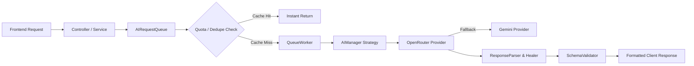

<div align="center">

# ⚡ HIRE-X
### *Next-Generation AI-Powered Career & Recruitment Intelligence Suite*

[](LICENSE)
[](https://reactjs.org/)
[](https://www.typescriptlang.org/)
[](https://vitejs.dev/)
[](https://nodejs.org/)
[](https://expressjs.com/)
[](https://www.mongodb.com/)
[](https://openrouter.ai/)
[](https://tailwindcss.com/)
[](https://vercel.com/)
[](https://render.com/)

<br/>

**Hire-X** is an enterprise-grade, full-stack career platform designed to automate and supercharge every phase of your job search — from **ATS-optimized resume generation** and **real-time resume scoring**, to **RAG-powered technical mock interview simulations**, **tailored cover letters**, and **personalized cold outreach campaigns**.

[Explore Features](#-features) • [Architecture](#-architecture) • [AI Engine](#-resilient-ai-pipeline) • [Quickstart](#-local-development-setup) • [Deployment Guide](#-production-deployment) • [API Docs](#-api-endpoints)

---

</div>

## 🌟 Key Highlights

- ⚡ **Zero Disruptive Design** — Stunning glassmorphic dark-mode UI powered by Tailwind CSS, Radix UI & Framer Motion.
- 🧠 **Resilient Multi-Model AI Pipeline** — Multi-tiered AI architecture featuring fallback chains across OpenRouter (`Ling-3.0-Flash`, `Gemini 2.0 Flash`, `Llama 3.3 70B`, `Qwen 2.5 72B`) and native Google Gemini.
- 🛡️ **Enterprise Security & Reliability** — Helmet headers, NoSQL injection sanitizers, Turnstile bot protection, request deduplication, rate limiters, and per-user daily token quotas.
- 🚀 **Dual Cloud Deployment Ready** — Pre-configured for seamless zero-config deployment on **Vercel** (Frontend) and **Render** (Backend) with **MongoDB Atlas**.

---

## 🚀 Features

<table>
  <tr>
    <td width="50%">
      <h3>📄 AI Resume Studio & Builder</h3>
      <ul>
        <li>Interactive multi-step resume creation with live PDF preview</li>
        <li>Instant AI bullet-point enhancer and action-verb generator</li>
        <li>Multi-format exports (PDF, JSON) with customizable layouts</li>
        <li>Cloud storage for managing multiple tailored profiles</li>
      </ul>
    </td>
    <td width="50%">
      <h3>🎯 ATS Resume & Job Match Analyzer</h3>
      <ul>
        <li>Deep ATS keyword scanning with real-time scoring (0-100)</li>
        <li>Skill gap identification & missing qualification alerts</li>
        <li>Job description compatibility breakdown and metric checks</li>
        <li>Actionable bullet-by-bullet rewriting suggestions</li>
      </ul>
    </td>
  </tr>
  <tr>
    <td width="50%">
      <h3>🎙️ Technical Mock Interview Workspace (RAG)</h3>
      <ul>
        <li>Simulated technical, behavioral, and system design interviews</li>
        <li><b>RAG Document Vault</b>: upload notes, PDFs, or docs to ground questions</li>
        <li>Real-time scoring, STAR evaluation, and model answers</li>
        <li>Personalized multi-week preparation roadmap & study plan</li>
      </ul>
    </td>
    <td width="50%">
      <h3>✉️ Outreach & Career Intelligence</h3>
      <ul>
        <li><b>Cold Email Generator</b>: High-converting recruiter pitch templates</li>
        <li><b>Cover Letter Generator</b>: Highly tailored, role-specific letters</li>
        <li><b>AI Career Assistant</b>: Interactive career coaching & negotiation</li>
        <li><b>Job Role Radar</b>: Intelligent skill-matched role suggestions</li>
      </ul>
    </td>
  </tr>
</table>

---

## 🏛️ Architecture

```
                                      HIRE-X ARCHITECTURE
                                      
  ┌─────────────────────────────────┐                 ┌─────────────────────────────────┐
  │         CLIENT LAYER            │                 │         BACKEND ENGINE          │
  │     (React 18 + Vite + TS)      │                 │      (Express 5 + Node.js)      │
  │                                 │                 │                                 │
  │  ┌───────────────────────────┐  │     HTTPS       │  ┌───────────────────────────┐  │
  │  │   Tailwind + shadcn/ui    │  │ ──────────────> │  │ Security Middleware       │  │
  │  │   Framer Motion Context   │  │                 │  │ (Helmet, CORS, Sanitizer) │  │
  │  └───────────────────────────┘  │                 │  └─────────────┬─────────────┘  │
  │  ┌───────────────────────────┐  │                 │                │                │
  │  │   apiClient.ts            │  │                 │  ┌─────────────▼─────────────┐  │
  │  │   • Timeout & Auto-Retry  │  │                 │  │ General & Auth Limiters   │  │
  │  │   • Token & Quota Sync    │  │ <────────────── │  │ (RateLimiter, Turnstile)  │  │
  │  └───────────────────────────┘  │      JSON       │  └─────────────┬─────────────┘  │
  └─────────────────────────────────┘                 └────────────────┼────────────────┘
                                                                       │
                                              ┌────────────────────────┴────────────────────────┐
                                              │                                                 │
                                     ┌────────▼────────┐                               ┌────────▼────────┐
                                     │  MongoDB Atlas  │                               │   AIManager     │
                                     │  Mongoose Pool  │                               │   AIRequestQueue│
                                     └─────────────────┘                               └────────┬────────┘
                                                                                                │
                                                       ┌────────────────────────────────────────┴────────┐
                                                       │                                                 │
                                              ┌────────▼────────┐                               ┌────────▼────────┐
                                              │  OpenRouter API │                               │   Gemini API    │
                                              │  (Primary LLMs) │                               │  (Direct / FB)  │
                                              └─────────────────┘                               └─────────────────┘
```

---

## ⚡ Resilient AI Pipeline

The Hire-X AI pipeline is engineered for 99.9% uptime, zero hallucinated JSON structures, and strict cost controls:



- **Per-User Quotas**: Daily allowance enforced via `QuotaManager`.
- **Request Deduplication**: In-flight parallel queries with identical payloads are safely merged.
- **Circuit-Breaker & Exponential Backoff**: Automatic retry on HTTP 429, timeouts, 5xx errors, or malformed JSON.
- **Safe JSON Healer**: Custom parser repairs markdown-wrapped or truncated JSON output.

---

## 🛠️ Technology Stack

| Layer | Technologies |
|---|---|
| **Frontend** | React 18, TypeScript, Vite 5, Tailwind CSS, shadcn/ui, Framer Motion, Lucide Icons |
| **Backend** | Node.js 18+, Express 5, Mongoose 8, Helmet, Compression, Express-Mongo-Sanitize |
| **Database** | MongoDB Atlas / Local MongoDB with connection pooling & auto-reconnection |
| **AI Integration**| OpenRouter SDK, Google Gemini SDK, Custom AIRequestQueue & Cache |
| **Security** | JWT authentication, bcrypt (salt 10), CORS whitelist, Cloudflare Turnstile |
| **Deployment** | Vercel (Frontend SPA), Render (Backend Web Service), MongoDB Atlas (Database) |

---

## 💻 Local Development Setup

### Prerequisites
- **Node.js** >= 18.0.0
- **MongoDB** (Local instance or MongoDB Atlas account)
- **OpenRouter API Key** (or Gemini API Key)

### 1. Clone the Repository
```bash
git clone https://github.com/anuragsinghrajput123456789/Hire_X_resumeMaker.git
cd Hire-XfinalVerdict
```

### 2. Backend Setup
```bash
cd backend
cp .env.example .env
npm install
npm run dev
```
> The backend will boot on `http://localhost:5000`.

### 3. Frontend Setup
```bash
cd ../frontend
cp .env.example .env
npm install
npm run dev
```
> The frontend will boot on `http://localhost:8080` (or `http://localhost:5173`).

---

## ⚙️ Environment Variables

### Backend (`backend/.env`)

| Variable | Required | Default | Description |
|---|---|---|---|
| `NODE_ENV` | No | `development` | Environment mode (`development` / `production`) |
| `PORT` | No | `5000` | Port for Express server |
| `MONGODB_URI` / `MONGO_URI` | **Yes** | — | MongoDB Atlas / Local connection string |
| `JWT_SECRET` | **Yes** | — | Secret for signing JWT tokens (min 32 chars) |
| `AI_PROVIDER` | No | `openrouter` | AI Engine provider (`openrouter` or `gemini`) |
| `OPENROUTER_API_KEY` | **Yes\*** | — | OpenRouter API Key |
| `OPENROUTER_MODEL` | No | `inclusionai/ling-3.0-flash:free` | Primary model identifier |
| `CLIENT_URL` | **Yes** | `http://localhost:8080` | Allowed CORS origins (comma-separated for multiples) |
| `AI_USAGE_LIMIT` | No | `500` | Daily AI token request quota per user |
| `AI_MAX_CONCURRENCY` | No | `3` | Maximum simultaneous worker AI requests |
| `OPENROUTER_REFERER` | No | `http://localhost:8080` | Referer header for OpenRouter analytics |
| `GEMINI_API_KEY` | No | — | Native Gemini key (optional) |

*\*At least one of `OPENROUTER_API_KEY` or `GEMINI_API_KEY` is required.*

### Frontend (`frontend/.env`)

| Variable | Required | Description |
|---|---|---|
| `VITE_API_URL` | **Yes** | Backend API base URL (e.g., `http://localhost:5000/api` or `https://your-backend.onrender.com/api`) |

> 🔒 **Security Notice**: Never put private API keys (`OPENROUTER_API_KEY`, `JWT_SECRET`, `MONGODB_URI`) into the frontend `.env`.

---

## 🚢 Production Deployment

For comprehensive step-by-step production setup guides, check **[docs/DEPLOYMENT.md](docs/DEPLOYMENT.md)**.

### Quick Deployment Checklist:
1. **Database**: Create a cluster on [MongoDB Atlas](https://www.mongodb.com/atlas), whitelist `0.0.0.0/0`, and copy your connection string.
2. **Backend on Render**:
   - Create a new **Web Service** pointing to `backend/`.
   - Set Build Command: `npm install`, Start Command: `npm start`.
   - Add Health Check Path: `/health`.
   - Set environment variables (`MONGODB_URI`, `JWT_SECRET`, `CLIENT_URL`, `OPENROUTER_API_KEY`, `NODE_ENV=production`).
3. **Frontend on Vercel**:
   - Create a new project pointing to `frontend/`.
   - Set framework preset to `Vite`.
   - Add environment variable `VITE_API_URL=https://your-backend.onrender.com/api`.
   - Add your Vercel production URL into Render's `CLIENT_URL`.

---

## 📡 API Endpoints

### Health & Diagnostics
- `GET /health` — Root health check probe for Render
- `GET /api/health` — Detailed server status
- `GET /api/ready` — Readiness probe (validates database connection)
- `GET /api/health/ai` — Real-time AI queue metrics & provider health

### Authentication
- `POST /api/auth/register` — Register a new account
- `POST /api/auth/login` — Sign in and receive JWT token
- `GET /api/auth/me` — Get authenticated user details

### AI Services
- `POST /api/ai/analyze-resume` — Full ATS scoring & gap analysis
- `POST /api/ai/analyze-resume-realtime` — Low-latency real-time score updates
- `POST /api/ai/generate-resume` — AI resume generation from user profiles
- `POST /api/ai/cover-letter` — Role-specific tailored cover letter generator
- `POST /api/ai/cold-email` — Recruiter cold outreach generation
- `POST /api/ai/chat` — Career intelligence studio chatbot
- `POST /api/ai/job-suggestions` — Tailored role recommendations

### Interview Workspace & RAG
- `POST /api/interviews/session/start` — Initialize mock interview session & roadmap
- `POST /api/interviews/session/answer` — Submit answer for real-time AI evaluation
- `POST /api/interviews/session/finalize` — Generate final report & study plan
- `POST /api/interviews/documents/upload` — Upload notes/PDFs for RAG grounding
- `GET /api/interviews/documents` — Search & list reference documents

---

## 🛡️ Security & Hardening

- 🔒 **CORS Filtering**: Strict origin validation dynamically checking `CLIENT_URL`.
- 🛡️ **Helmet Headers**: Comprehensive Content Security Policy, X-Frame-Options, and HSTS.
- 🧹 **NoSQL Sanitization**: Deep query filtering with `express-mongo-sanitize`.
- ⏱️ **Rate Limiting**: Multi-tiered limits protecting against brute-force and scraping.
- 🗄️ **Dual Database Handling**: Automatic resolution of `MONGODB_URI` and `MONGO_URI`.

---

## 📄 License

Distributed under the **MIT License**. See `LICENSE` for more information.

---

<div align="center">
  <sub>Built with ❤️ by the Hire-X Engineering Team</sub>
</div>
