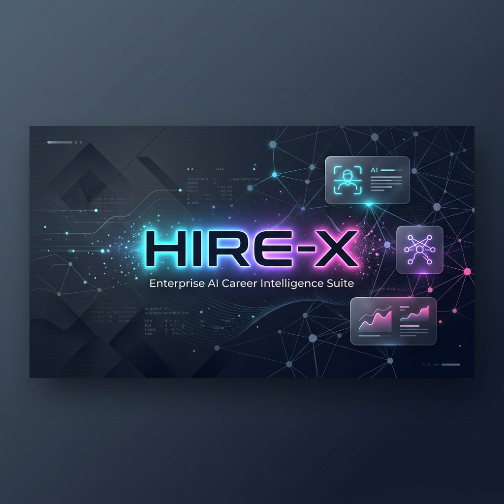
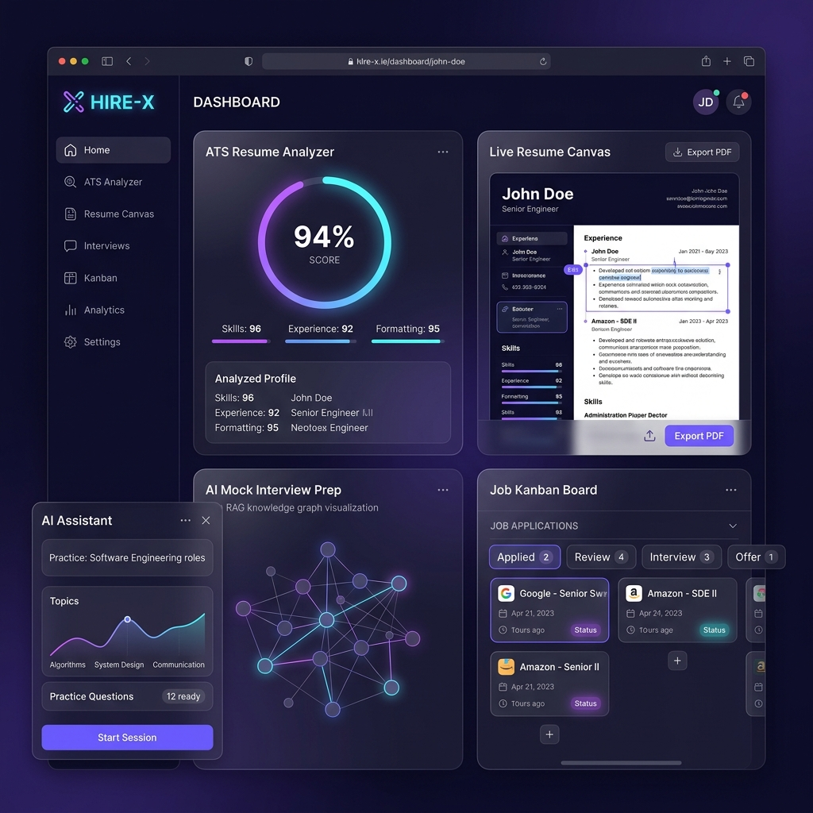
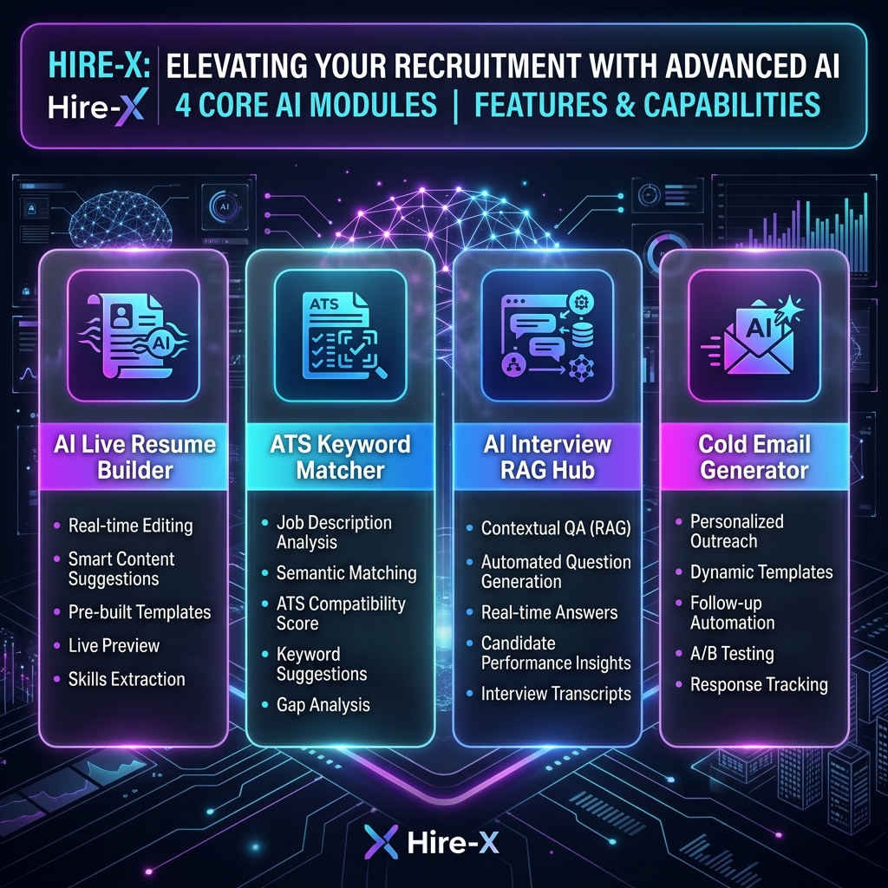
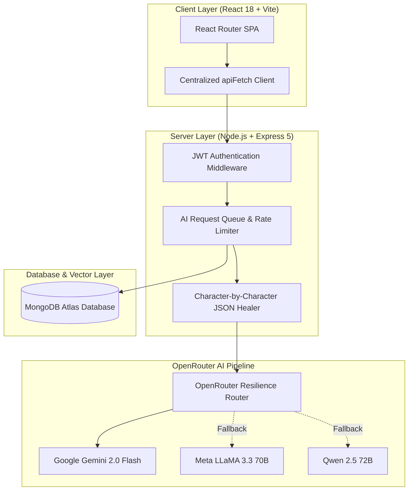

<div align="center">

  

  # 🚀 Hire-X — Enterprise AI Career Intelligence Suite

  <p align="center">
    <strong>An end-to-end, full-stack AI Career Intelligence & Job Hunt Operating System.</strong><br/>
    Accelerate your job search with live ATS resume optimization, tailored cover letters, AI cold outreach, semantic RAG mock interviews, and a real-time Kanban application tracker.
  </p>

  <p align="center">
    
    
    
    
    
    
    
    
    
    
  </p>

</div>

---

## ⚡ Overview & Platform Highlights

**Hire-X** is an enterprise-grade AI Career Intelligence Suite designed to give job seekers an unfair advantage in today's competitive market. Built with modern web technologies and Powered by advanced LLMs via OpenRouter, Hire-X streamlines every stage of the recruitment funnel — from crafting high-impact resumes to cracking technical interviews and tracking job offers.

<div align="center">
  
</div>

---

## 🌟 Core Modules & Capabilities

<div align="center">
  
</div>

### 📄 1. Live Interactive Resume Builder & PDF Engine
* **A4 Canvas Live Preview**: Split-pane editor featuring responsive live canvas scaling powered by `ResizeObserver`.
* **4 Executive Templates**: Modern, Classic, Creative, and Professional layout structures crafted with custom typography.
* **Pixel-Perfect PDF Export**: Generates print-ready A4 PDFs matching the live canvas identically via `html2pdf.js`.
* **Smart Content Sanitizer**: Suppresses empty bullet points and unformatted blocks gracefully to prevent layout distortion.

### 🎯 2. ATS & Resume Compatibility Analyzer
* **Keyword Matcher**: Cross-analyzes candidate experience against job descriptions to spot missing hard/soft skills.
* **ATS Compatibility Score**: Generates comprehensive ATS readability ratings, formatting recommendations, and actionable score fixes.

### ✉️ 3. Tailored AI Cover Letter Generator
* **Role & Company Alignment**: Crafts customized, compelling cover letters tuned specifically to target position requirements.
* **Tone & Depth Controls**: Customize tone (*Professional, Confident, Executive, Creative*) and output length (*Short, Medium, Comprehensive*).
* **Export & History**: Download letters as polished PDFs or save them directly in your account history dashboard.

### 📩 4. AI Cold Email Outreach Engine
* **High-Conversion Messaging**: Generates tailored outreach emails for recruiters, engineering hiring managers, and founders.
* **Stack & Note Customization**: Highlights personal projects and technical stack alignment automatically.
* **One-Click Actions**: Quick copy to clipboard and saved history management.

### 🎙️ 5. Interview Intelligence & RAG Knowledge Hub
* **Adaptive AI Mock Interviews**: Dynamic technical and behavioral question sequences tailored by role, company, and difficulty level.
* **RAG Context Knowledge Base**: Upload custom preparation notes and PDFs for vector-retrieved semantic context during practice sessions.
* **Real-time Answer Scoring**: Receive instant evaluations, missing technical keywords, model answers, and custom study plans.

### 📊 6. Job Application Kanban Tracker
* **Visual Pipeline**: Drag-and-drop organize applications across active stages (`Saved`, `Applied`, `Interviewing`, `Offer`, `Rejected`).
* **Comprehensive Logging**: Track application links, salary expectations, follow-up dates, custom notes, and interview status.

---

## 🏗️ System Architecture & AI Pipeline



### Key Architectural Safeguards
* **Resilient AI Pipeline**: Features request deduplication (`RequestDeduplicator`), prompt injection filters (`RequestValidator`), priority queueing (`AIRequestQueue`), and character-by-character JSON healing (`JsonExtractor`).
* **Robust Client Networking**: Centralized HTTP client (`apiClient.ts`) enforcing 30s/60s request timeouts, automatic 1x retries on transient network/5xx drops, and seamless JWT session renewal.

---

## 📁 Repository Structure

```
Hire-X/
├── assets/                    # Graphic banners, logos, and UI screenshots
├── DEPLOYMENT.md              # Production Cloud Deployment Guide (Vercel & Render)
├── README.md                  # Comprehensive Repository & Setup Manual
├── doc/                       # Architecture & Operations Documentation
│   ├── API_FLOW.md            # End-to-End API Sequence Diagrams
│   ├── ARCHITECTURE.md        # Technical System & Design Patterns
│   ├── CASE_STUDY.md          # Project Case Study & Problem Statement
│   ├── DEPLOYMENT_RENDER.md   # Render Backend Deployment Operations
│   ├── DEPLOYMENT_VERCEL.md   # Vercel Frontend Deployment Operations
│   ├── OPERATIONS.md          # Maintenance & Incident Response Playbook
│   └── PRODUCTION_READINESS.md# SRE Checklist & Health Diagnostics
├── backend/                   # Express 5 REST API & AI Service Engine
│   ├── config/                # Environment Validation & DB Connector
│   ├── middleware/            # JWT Auth & Error Handling Stack
│   ├── models/                # Mongoose Database Schemas
│   └── src/
│       ├── ai/                # AI Queue Engine, Prompts & JSON Parsers
│       └── features/          # Modular API Feature Route Controllers
└── frontend/                  # React 18 + TypeScript SPA Client
    ├── public/                # Favicons & Static Public Web Assets
    ├── vercel.json            # Vercel SPA Routing & Security Headers
    └── src/
        ├── config/            # Frontend Constants & System Configurations
        ├── features/          # Feature UI Modules & Form Components
        ├── hooks/             # Custom React Hooks (useResume, useInterview, etc.)
        ├── pages/             # Lazy-Loaded Route Components
        ├── services/          # HTTP API Fetch Service Infrastructure
        └── types/             # Shared TypeScript Data Interfaces
```

---

## ⚡ Quick Start & Development Setup

### Prerequisites
- **Node.js**: `v18.x` or higher
- **npm**: `v9.x` or higher
- **MongoDB**: Local MongoDB instance or [MongoDB Atlas](https://www.mongodb.com/cloud/atlas) account URI
- **OpenRouter API Key**: Obtain from [OpenRouter.ai](https://openrouter.ai/)

---

### 1. Backend API Setup

```bash
# Navigate to the backend directory
cd backend

# Install dependencies
npm install

# Create environment file from template
cp .env.example .env
```

Configure your **`backend/.env`**:
```env
NODE_ENV=development
PORT=5000
MONGO_URI=mongodb://127.0.0.1:27017/hirex
JWT_SECRET=your_super_secure_random_jwt_secret_key_min_32_chars
OPENROUTER_API_KEY=sk-or-v1-your-openrouter-api-key
OPENROUTER_MODEL=google/gemini-2.0-flash-001
CLIENT_URL=http://localhost:5173
```

Run backend in development mode:
```bash
npm run dev
```
*(Backend server runs at `http://localhost:5000`. Health check endpoint: `http://localhost:5000/api/health`)*

---

### 2. Frontend Client Setup

```bash
# Open a new terminal and navigate to frontend directory
cd frontend

# Install dependencies
npm install

# Create environment file from template
cp .env.example .env
```

Configure your **`frontend/.env`**:
```env
VITE_API_URL=http://localhost:5000/api
```

Run frontend in development mode:
```bash
npm run dev
```
*(Client application launches at `http://localhost:5173` or `http://localhost:8080`)*

---

## 🌐 Production Deployment

Hire-X is fully configured for automated cloud deployment:

- **Frontend (Vercel)**: Follow the guide in [DEPLOYMENT.md](DEPLOYMENT.md#%-part-2-deploying-frontend-to-vercel).
- **Backend API (Render)**: Follow the guide in [DEPLOYMENT.md](DEPLOYMENT.md#%-part-1-deploying-backend-to-render).
- **Production Checklist**: Review [doc/PRODUCTION_READINESS.md](doc/PRODUCTION_READINESS.md) for health probe monitoring and SRE guidelines.

```bash
# Verify local production build of frontend
cd frontend && npm run build

# Verify local production server execution of backend
cd backend && npm start
```

---

## 📘 Project Documentation Index

| Document | Focus Area |
| :--- | :--- |
| 🚀 **[DEPLOYMENT.md](DEPLOYMENT.md)** | Step-by-Step Production Cloud Deployment Guide |
| 🏛️ **[doc/ARCHITECTURE.md](doc/ARCHITECTURE.md)** | System Design, AI Queue & Reliability Engine |
| 📊 **[doc/API_FLOW.md](doc/API_FLOW.md)** | End-to-End API Sequence Flows & Payload Schemas |
| 🛡️ **[doc/PRODUCTION_READINESS.md](doc/PRODUCTION_READINESS.md)** | SRE Monitoring, Health Probes & Operational Audit |
| 💼 **[doc/CASE_STUDY.md](doc/CASE_STUDY.md)** | Product Strategy, Business Value & Tech Stack Case Study |

---

## 📜 License & Acknowledgments

Distributed under the **MIT License**. See [`LICENSE`](LICENSE) for details.

Built with ❤️ by the Hire-X Engineering Team.
