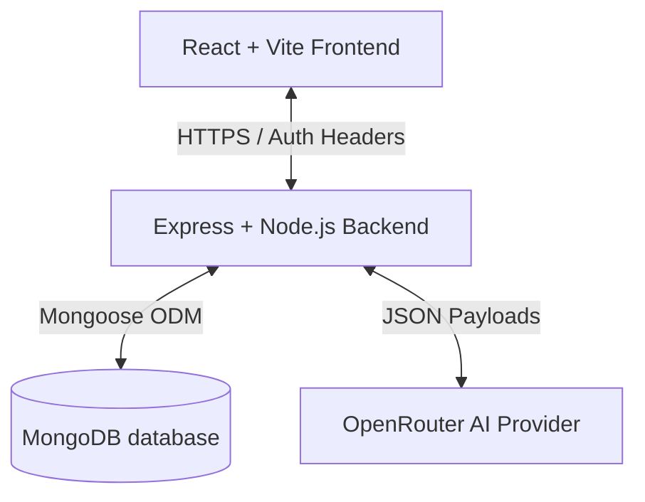

# 🚀 Hire-X — Ultimate AI Resume Builder & Career Suite

<div align="center">
  
  [](https://react.dev/)
  [](https://www.typescriptlang.org/)
  [](https://nodejs.org/)
  [](https://www.mongodb.com/)
  [](https://tailwindcss.com/)
  [](https://opensource.org/licenses/MIT)

  <p align="center">
    <strong>An enterprise-grade, full-stack AI Career Suite that transforms job application workflows. Build high-fidelity ATS-optimized resumes with real-time responsive scaling, analyze descriptions against job descriptions, track job applications, and generate professional recruiter outreach cold emails.</strong>
  </p>

</div>

---

## 🌟 Key Features

### 📄 1. High-Fidelity AI Resume Builder
* **Premium Live Preview Canvas**: Features a responsive split-workspace design that auto-centers A4 resume canvas templates utilizing high-performance reactive `ResizeObserver` loops.
* **4 Professional Templates**: Seamlessly switch between Modern, Classic, Creative, and Professional structures with beautiful typography and clean grid systems.
* **Intelligent PDF Render Pipeline**: Generates flat, high-fidelity, high-resolution printable A4 PDFs that match the live canvas layout identically.
* **Pristine State Placeholders**: Populates interactive dummy content instantly upon page load to give users immediate interactive design contexts.
* **Data Sanitization**: Employs strict whitespace sanitization so that unused lists, experience sections, or project descriptions fade away elegantly without rendering empty bullet points or stray margins.

### 🧠 2. Deep AI Recruiter Outreach & Chat
* **AI Career Chatbot**: Instant interactive career counselling, resume feedback, and target job interview preparation.
* **AI Cold Email Generator**: Creates customized, high-converting recruiter cold emails from a set of simple outreach parameters, persisting generated history directly to your secure user history dashboard.

### 🎯 3. ATS & Resume Description Analyzer
* **Real-time Keyword Matcher**: Scans resume text against industry standard guidelines, returning matching and missing keyword indicators.
* **ATS Compatibility Scoring**: Renders exact structural readability scores, found formatting defects, and overall strength levels based on specific targeted positions.
* **Job Description Evaluator**: Directly compares active copy pasted descriptions against your current resume blocks, pinpointing key insertions and missing skills.

### 📊 4. Job Application Kanban tracker
* **Unified Kanban Tracking**: Save, update, and manage job pipelines (Applied, Interview, Offer, Rejected) along with salary scales, custom notes, links, and dates.

---

## 🛠️ Technology Stack



### Frontend
* **Core Framework**: React 18 & Vite (Supercharged dev startup)
* **Type Safety**: TypeScript 5
* **Styling**: TailwindCSS & Shadcn UI Components
* **Dynamic Animations**: Framer Motion & Lucide Icons
* **PDF Compile Engine**: `html2pdf.js` & `html2canvas`

### Backend
* **Runtime**: Node.js & Express 5
* **Database Interface**: Mongoose 9 (MongoDB ODM)
* **Auth**: JSON Web Tokens (JWT) & BcryptJS password hashing
* **AI Provider**: OpenRouter Client integrations using robust fallback model routines (`google/gemini-flash-1.5`)

---

## 🚀 Getting Started

### Prerequisites
* **Node.js** (v18.x or higher)
* **MongoDB** (Local instance running or MongoDB Atlas Connection string)
* **OpenRouter API Key** (For powering the suite's AI modules)

---

### 📂 Repository Folder Structure

```
Hire-XfinalVerdict/
├── backend/            # Express REST API Server
│   ├── config/         # Environment and Database connectors
│   ├── controllers/    # Route controllers (AI, Auth, Resumes, Chats)
│   ├── middleware/     # Auth checks, global Express error handlers
│   ├── models/         # Mongoose DB Schemas
│   └── routes/         # API Endpoint bindings
├── frontend/           # Vite + React Client
│   ├── src/
│   │   ├── components/ # Premium UI blocks & Resume templates
│   │   ├── context/    # Global Auth States
│   │   ├── lib/        # Sanitization helpers
│   │   ├── pages/      # Views (Generator, ATS, Tracker, Dashboard)
│   │   └── services/   # Client API connectors
```

---

### 💻 Step-by-Step Installation

#### 1. Setup the Backend Server
```bash
# Navigate to backend directory
cd backend

# Install all backend dependencies
npm install

# Create your .env file from the example
cp .env.example .env
```

Configure your **`backend/.env`** file:
```env
PORT=5000
MONGO_URI=mongodb://127.0.0.1:27017/hirex
JWT_SECRET=YOUR_SECURE_JWT_SECRET_KEY_AT_LEAST_32_CHARS
OPENROUTER_API_KEY=your-openrouter-api-key
```

*Note: Ensure your `JWT_SECRET` is at least 32 characters long to satisfy security runtime validation constraints.*

#### 2. Start the Backend Server
```bash
# Start in development mode with Nodemon
npm run dev
```

The backend server will spin up on **`http://localhost:5000`** and log a successful MongoDB connection.

---

#### 3. Setup the Frontend Client
```bash
# Navigate to the frontend directory
cd ../frontend

# Install all frontend dependencies
npm install

# Create your .env file
echo "VITE_API_URL=http://localhost:5000/api" > .env
```

#### 4. Start the Frontend Client
```bash
# Start Vite development server
npm run dev
```

The frontend application will spin up on **`http://localhost:8080`** or **`http://localhost:5173`** with hot-module reloading enabled!

---

## 🏭 Production Build & Deployment

To build the client app for production:

```bash
cd frontend
npm run build
```

This compiles optimized static bundles into the `dist` directory, fully prepared for deployment on hosting providers such as Vercel, Netlify, or AWS Amplify.

To start the backend in production mode:
```bash
cd backend
npm start
```

---

## 🔒 Security & Best Practices
* **Environment Validation**: Built-in backend validation verifies all environment parameters (JWT length, DB connectivity) prior to port binding to prevent failures in production.
* **Robust Error Handling**: Explicit Express middleware captures database constraint failures (`Duplicate Resource 11000`), CastErrors, and validations, presenting user-friendly messages while keeping server logs safe.
* **CORS Policies**: Pre-configured dynamic origin checking protects server access while supporting seamless development.

---

## 📄 License
This project is licensed under the MIT License - see the [LICENSE](LICENSE) file for details.
