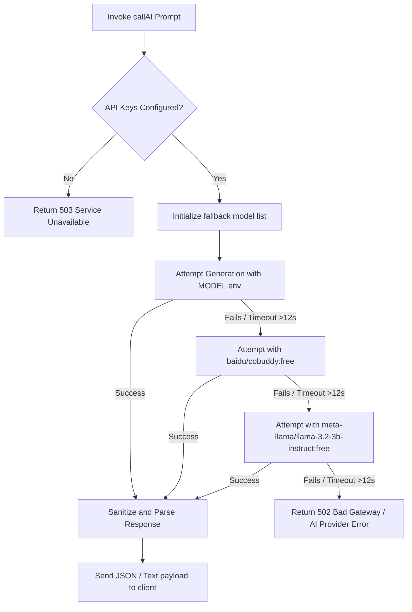

# Hire-X API Endpoint and Flow Guide

This document catalogs the REST API endpoints of **Hire-X**, explains the standard request/response lifecycle, and details the AI provider invocation sequence.

---

## 🔌 API Endpoints Catalog

All API endpoints are prefixed with `/api`. Access rules are defined as:
*   🔓 **Public**: Requires no authentication.
*   🔒 **Private**: Requires a valid HTTP header `Authorization: Bearer <JWT_TOKEN>`.

### 1. Authentication (`/api/auth`)
*   `POST /register` | 🔓 | Register a new user account.
    *   **Body**: `{ "name": "Name", "email": "email@domain.com", "password": "securepassword" }`
    *   **Response**: `201` + `{ "_id": "...", "name": "...", "email": "...", "token": "JWT_TOKEN" }`
*   `POST /login` | 🔓 | Log in an existing user.
    *   **Body**: `{ "email": "email@domain.com", "password": "securepassword" }`
    *   **Response**: `200` + `{ "_id": "...", "name": "...", "email": "...", "token": "JWT_TOKEN" }`
*   `GET /me` | 🔒 | Fetch details of the authenticated user.
    *   **Response**: `200` + `{ "_id": "...", "name": "...", "email": "...", "aiUsage": 12 }`

### 2. Resume Management (`/api/resumes`)
*   `POST /` | 🔒 | Save or update a resume.
    *   **Body**: Custom resume object (see Resume Schema). Include `_id` to perform an update; omit to create a new resume.
    *   **Response**: `200` + `{ "success": true, "data": { ...savedResume } }`
*   `GET /` | 🔒 | Retrieve all resumes saved by the user.
    *   **Response**: `200` + `{ "success": true, "count": 2, "data": [...] }`
*   `DELETE /:id` | 🔒 | Delete a resume by ID.
    *   **Response**: `200` + `{ "success": true, "message": "Resume deleted" }`

### 3. Career AI Chat (`/api/chats`)
*   `GET /` | 🔒 | Retrieve all user chat threads.
    *   **Response**: `200` + List of Chat documents.
*   `POST /` | 🔒 | Start a new chat thread.
    *   **Body**: `{ "messages": [], "title": "New Chat" }`
    *   **Response**: `201` + Created Chat document.
*   `GET /:id` | 🔒 | Retrieve a single chat thread.
    *   **Response**: `200` + Chat document.
*   `PUT /:id` | 🔒 | Update a chat (append messages / update title).
    *   **Body**: `{ "message": { "role": "user", "content": "..." }, "title": "Updated Title" }`
    *   **Response**: `200` + Updated Chat document.
*   `DELETE /:id` | 🔒 | Delete a chat thread.
    *   **Response**: `200` + `{ "id": "..." }`

### 4. Recruiter Cold Emails (`/api/cold-email`)
*   `POST /save` | 🔒 | Save a generated cold email.
    *   **Body**: `{ "recipientName": "...", "recipientEmail": "...", "recipientCompany": "...", "recipientRole": "...", "jobTitle": "...", "content": "..." }`
    *   **Response**: `201` + Saved ColdEmail document.
*   `GET /history` | 🔒 | Retrieve email generation history.
    *   **Response**: `200` + List of ColdEmail documents.
*   `DELETE /:id` | 🔒 | Delete a saved email.
    *   **Response**: `200` + `{ "message": "Email removed" }`

### 5. Job Application Tracker (`/api/applications`)
*   `GET /` | 🔒 | Retrieve all tracked applications.
    *   **Response**: `200` + List of JobApplication documents.
*   `POST /save` | 🔒 | Add a new job application.
    *   **Body**: `{ "company": "...", "role": "...", "status": "Applied", "salary": "...", "jobLink": "...", "notes": "..." }`
    *   **Response**: `201` + Saved JobApplication document.
*   `PUT /:id` | 🔒 | Update status, notes, or details of an application.
    *   **Body**: `{ "status": "Interview", "notes": "Scheduled for Friday" }`
    *   **Response**: `200` + Updated JobApplication document.
*   `DELETE /:id` | 🔒 | Delete an application.
    *   **Response**: `200` + `{ "message": "Application removed" }`

### 6. Core AI Operations (`/api/ai`)
*   `POST /chat` | 🔒 | Prompt the Career Chatbot (takes up to 5 history messages).
    *   **Body**: `{ "message": "hello", "history": [...] }`
    *   **Response**: `200` + `{ "result": "AI generated message response" }`
*   `POST /cold-email` | 🔒 | Generate outreach cold email contents.
    *   **Body**: `{ "prompt": "Generate a professional cold email for..." }`
    *   **Response**: `200` + `{ "result": "email body content..." }`
*   `POST /analyze-realtime` | 🔒 | Perform lightweight real-time keyword analysis.
    *   **Body**: `{ "resumeText": "...", "jobRole": "Software Developer" }`
    *   **Response**: `200` + `{ "keywordMatchScore": 75, "foundKeywords": [...], "missingKeywords": [...], "readabilityScore": 80, "structureAnalysis": { ... }, "formattingIssues": [...] }`
*   `POST /analyze` | 🔒 | Analyze resume structure against general ATS guidelines.
    *   **Body**: `{ "resumeText": "...", "jobRole": "..." }`
    *   **Response**: `200` + `{ "atsScore": 85, "missingKeywords": [...], "formatSuggestions": [...], "improvements": [...], "matchingJobRoles": [...] }`
*   `POST /analyze-jd` | 🔒 | Compare resume against job description.
    *   **Body**: `{ "resumeText": "...", "jobDescription": "..." }`
    *   **Response**: `200` + `{ "requiredKeywords": [...], "missingFromResume": [...], "recommendedSkills": [...], "keywordInsertions": [...] }`
*   `POST /suggestions` | 🔒 | Request job titles and industries recommendation.
    *   **Body**: `{ "resumeText": "...", "targetRole": "..." }`
    *   **Response**: `200` + `{ "result": "career recommendations..." }`
*   `POST /generate-resume` | 🔒 | Re-optimize resume fields using the STAR method.
    *   **Body**: `{ "data": { ...rawResumeData } }`
    *   **Response**: `200` + `{ "success": true, "result": "...", "parsedData": { ...optimizedStructuredData } }`

---

## 🔄 API Request Lifecycle Flow

Every private REST call is handled through a sequence of Express middleware components:

```
[Client App Request]
        │
        ▼
[CORS Origin Check] ──(Blocked)──> 403 Forbidden
        │ (Allowed)
        ▼
[Auth Header Extraction]
        │ (No token / Bad format)
        ├────────────────────────> 401 Unauthorized
        │ (Bearer Token found)
        ▼
[JWT Verification] ──(Expired/Invalid)──> 401 Unauthorized
        │
        ▼
[DB User Retrieval] ──(User missing)──> 401 Unauthorized
        │ (User object attached to req.user)
        ▼
[Controller Route Handler]
        │
        ├──(Throws Parameter Error)──> 400 Bad Request
        │
        ├──(Processes DB operations)
        │       │
        │       ▼
        │  [Sends JSON Response]
        │
        ▼ (Uncaught exception/Cast error/Duplicate index)
[Global Error Middleware]
        │
        ▼
   400 CastError / 409 Duplicate / 500 Generic Error
```

---

## 🤖 OpenRouter AI Invocation Sequence

To guarantee uptime against upstream model rate limits, API key suspensions, or temporary server issues, the `callAI` function runs a resilient, multi-model execution chain:



### Response Sanitization & Repair
When requesting structured output, the backend enforces JSON compliance using a parsing helper:
1.  **Tag Stripping**: Removes markdown blocks like ` ```json ` or ` ``` `.
2.  **Bracket Matching**: Extracts string boundaries containing curly braces `{ ... }` to avoid headers or trailers.
3.  **Tailing Commas Cleanup**: Uses regular expressions to remove trailing commas before closing braces/brackets (e.g. `[1, 2,]` to `[1, 2]`), which commonly crash standard `JSON.parse` executions.
